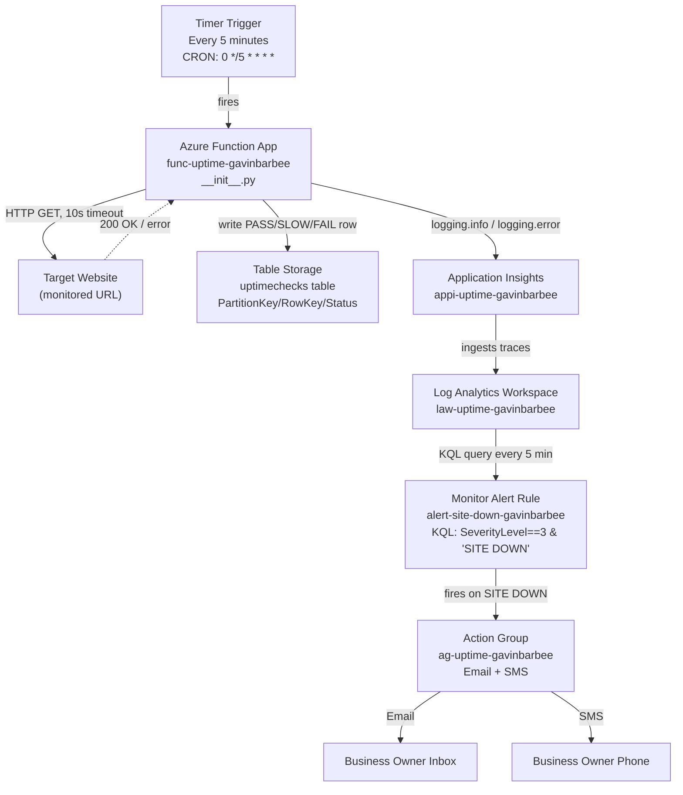
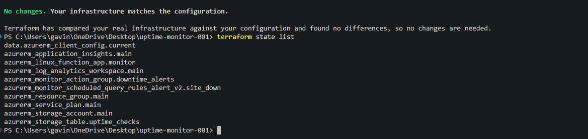
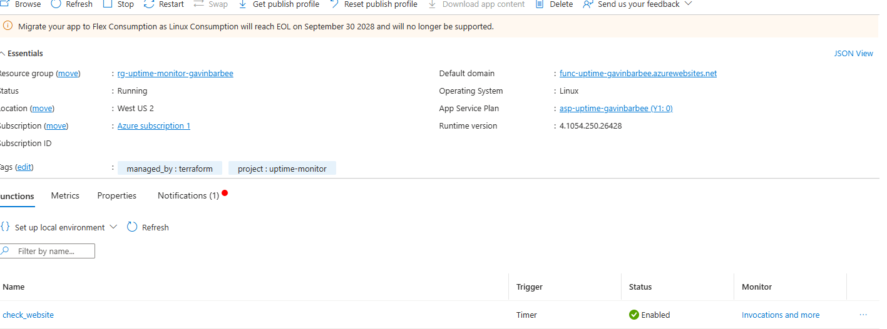
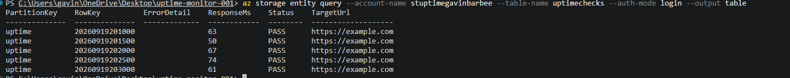
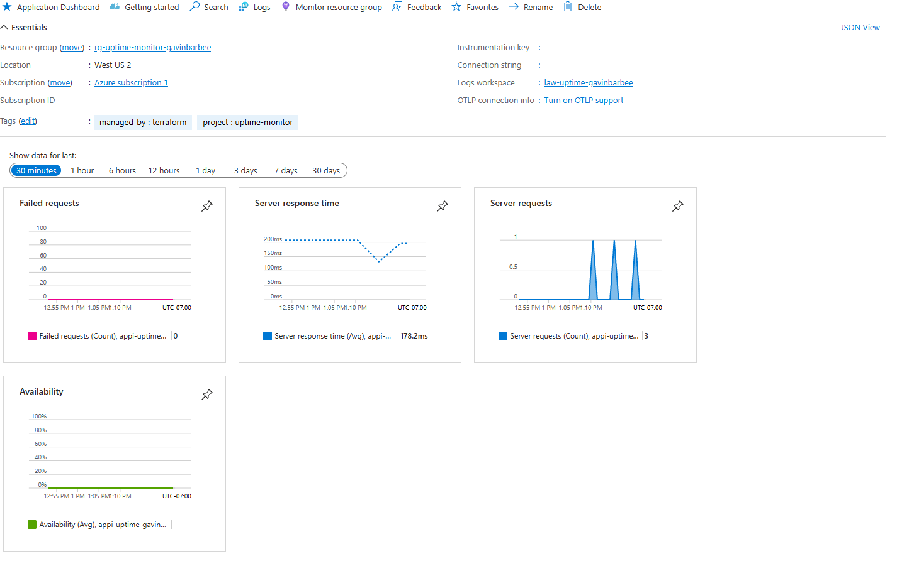
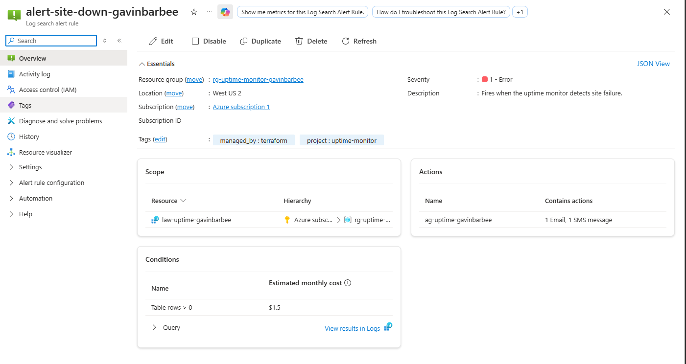

# Azure Website Uptime Monitor

**Status:** ✅ Built, deployed, and verified end-to-end — the monitor is checking the target site every 5 minutes, writing results to Table Storage, and the alert pipeline is confirmed live.

## 🎬 Video Walkthrough

[](https://www.loom.com/share/82035ae011034f99b51ca28fb121b61b)

---

## 📖 Project Overview

Every business with a website lives with this fear: the site goes down, a customer tries to visit and gets an error, they leave and never come back — and the business owner doesn't find out until someone calls to complain, or they check sales numbers the next day and wonder why everything dropped off.

This project eliminates that blind spot. The system checks the target website every five minutes, 24 hours a day. It tests three things on every check: does it load, how fast does it load, and is it showing the right content. It fires an alert within seconds of any failure, and it writes every check result to storage so there's a complete history of every incident.

**Business outcome:** a system that detects website downtime within seconds and alerts the business owner immediately — turning an invisible problem into something that can be responded to in real time.

### Skills Demonstrated
- Infrastructure as Code with Terraform (`azurerm` provider)
- Azure Functions — timer-triggered serverless compute on the Consumption plan
- Azure Table Storage — a lightweight, schema-flexible datastore for time-series check results
- Application Insights + Log Analytics — application telemetry feeding a KQL-based alert
- Azure Monitor — scheduled query alert rules, multi-channel Action Groups (email + SMS)
- Python — HTTP health checks, error handling, structured logging that feeds an alert pipeline
- Two-stage deployment — separating infrastructure (Terraform) from application code (`az functionapp deployment source config-zip`), the same separation real teams use between infra and app pipelines

---

## 🏗️ Architecture Diagram



**How a failure alert flows end to end:** the timer fires and triggers the Function → the Function calls the target URL with a 10-second timeout → if the site is down, the Function writes a FAIL row to Table Storage and calls `logging.error()` → Application Insights receives the error log at severity 3 → Log Analytics ingests the trace (typically within 1–2 minutes) → the alert rule's KQL query finds the "SITE DOWN" message and fires → the Action Group sends email and SMS within seconds of the alert firing. Total time from site going down to owner receiving an SMS: under 10 minutes worst case, under 3 minutes typical.

---

## ✅ Prerequisites

**1. Azure CLI, Terraform** — already installed if you completed Projects 1 or 2.

**2. Python 3** — any reasonably current version works locally (this build used 3.13). It does **not** need to match the Function App's runtime (3.12) — Step 8 uses explicit `--platform`/`--python-version`/`--abi` flags to fetch the correct Linux-compatible packages regardless of the local Python version. Check with:
```powershell
python --version
```

**3. Log in to Azure**
```powershell
az login
az account set --subscription "Azure subscription 1"
az account show
```

**4. Check available vCPU quota** (Consumption-plan Function Apps can still be blocked by regional quota on free/trial subscriptions):
```powershell
az vm list-usage --location "East US" --query "[?name.value=='cores']" -o table
```
If quota shows 0, use `West US 2` as the location instead — see Troubleshooting if this comes up.

---

## 🏷️ Naming Conventions

All resource names use `gavinbarbee` in place of `[yourname]`.

| Resource | Naming Pattern | Example |
|---|---|---|
| Resource Group | `rg-uptime-monitor-[yourname]` | `rg-uptime-monitor-gavinbarbee` |
| Storage Account | `stuptime[yourname]` | `stuptimegavinbarbee` |
| Storage Table | `uptimechecks` | `uptimechecks` |
| Log Analytics Workspace | `law-uptime-[yourname]` | `law-uptime-gavinbarbee` |
| Application Insights | `appi-uptime-[yourname]` | `appi-uptime-gavinbarbee` |
| App Service Plan | `asp-uptime-[yourname]` | `asp-uptime-gavinbarbee` |
| Function App | `func-uptime-[yourname]` | `func-uptime-gavinbarbee` |
| Action Group | `ag-uptime-[yourname]` | `ag-uptime-gavinbarbee` |
| Action Group Short Name | — | `uptime` |
| Monitor Alert Rule | `alert-site-down-[yourname]` | `alert-site-down-gavinbarbee` |
| Function Name | `check_website` | `check_website` |

---

## 🪜 Project Steps

### Step 1 — Create the Project Folder and Files

The `__init__.py` and `function.json` files must live inside a `check_website/` subfolder, not directly in `function_app/` — this matches an Azure Functions Linux requirement. The function's entry-point file must be named `__init__.py` specifically — Azure's Python worker doesn't reliably honor a `scriptFile` override to a different filename (see Troubleshooting).

```powershell
New-Item -ItemType Directory -Force -Path "$HOME\uptime-monitor-001\function_app\check_website" | Out-Null
cd "$HOME\uptime-monitor-001"

New-Item -ItemType File -Force -Path @(
  "main.tf"
  "variables.tf"
  "outputs.tf"
  "terraform.tfvars"
  ".gitignore"
  "function_app\host.json"
  "function_app\requirements.txt"
  "function_app\check_website\function.json"
  "function_app\check_website\__init__.py"
) | Out-Null

Get-ChildItem -Recurse -File | Select-Object FullName
```

Expected structure:
```
uptime-monitor-001/
├── main.tf
├── variables.tf
├── outputs.tf
├── terraform.tfvars
├── .gitignore
└── function_app/
    ├── host.json              ← Azure Functions runtime identifier
    ├── requirements.txt       ← Python library list
    └── check_website/         ← Subfolder named after the function
        ├── function.json      ← Timer trigger binding
        └── __init__.py        ← Monitoring logic (must be named __init__.py, not scriptFile)
```

**Create `.gitignore`:**
```powershell
@(
  "terraform.tfvars"
  "*.tfvars"
  ".terraform/"
  ".terraform.lock.hcl"
  "*.tfstate"
  "*.tfstate.backup"
  "*.tfplan"
  "__pycache__/"
  "*.pyc"
  ".python_packages/"
  "function_deploy.zip"
  "deploy_temp/"
) | Set-Content .gitignore
```

---

### Step 2 — Write `variables.tf`

```hcl
variable "yourname" {
  description = "Your name, lowercase, no spaces. Used to name all resources."
  type        = string
}

variable "location" {
  description = "Azure region. If you hit a quota error in East US, use West US 2."
  type        = string
  default     = "East US"
}

variable "target_url" {
  description = "The website URL to monitor. Must include https://."
  type        = string
}

variable "alert_email" {
  description = "Email address that receives downtime alerts."
  type        = string
}

variable "alert_phone" {
  description = "Phone number for SMS alerts. E.164 format: +14045550100"
  type        = string
}

variable "tags" {
  type = map(string)
  default = {
    project    = "uptime-monitor"
    managed_by = "terraform"
  }
}
```

---

### Step 3 — Write `terraform.tfvars`

```hcl
yourname    = "gavinbarbee"
location    = "East US" # Change to "West US 2" if you hit a quota error
target_url  = "https://example.com"
alert_email = "your.email@example.com"
alert_phone = "+14045550100" # E.164 format: +1 then 10 digits, no spaces or dashes
```

> ⚠️ The phone number must be typed exactly like this — `+1` immediately followed by 10 digits, no spaces, dashes, or parentheses. The Terraform strips `+1` and dashes with an exact string match (`replace(var.alert_phone, "+1", "")`); any other format and that replace silently does nothing, producing a malformed SMS receiver.

---

### Step 4 — Write the Function Code

**`function_app/host.json`** — required at the root of `function_app/`. Without it, the Function App shows "Runtime version: Error" and never executes.

```json
{
  "version": "2.0",
  "logging": {
    "applicationInsights": {
      "samplingSettings": {
        "isEnabled": true
      }
    }
  }
}
```

**`function_app/requirements.txt`**

```
azure-data-tables==12.4.3
requests==2.31.0
```

**`function_app/check_website/function.json`** — the timer trigger binding. Must live inside the `check_website/` subfolder. No `scriptFile` key is needed — Azure's Python worker expects the entry-point file to be named `__init__.py` by default, and a `scriptFile` override to a different filename wasn't reliably honored during this build (see Troubleshooting).

```json
{
  "bindings": [
    {
      "name": "mytimer",
      "type": "timerTrigger",
      "direction": "in",
      "schedule": "0 */5 * * * *"
    }
  ]
}
```

`0 */5 * * * *` is a CRON expression (seconds, minutes, hours, day-of-month, month, day-of-week). `*/5` in minutes means every 5 minutes; the leading `0` means at second zero.

**`function_app/check_website/__init__.py`** — the monitoring logic. Must be named exactly `__init__.py`.

```python
import azure.functions as func
from azure.data.tables import TableServiceClient
import requests
import datetime
import os
import logging


def main(mytimer: func.TimerRequest) -> None:
    target_url = os.environ["TARGET_URL"]
    storage_conn = os.environ["AzureWebJobsStorage"]

    check_time = datetime.datetime.utcnow()
    result_status = "PASS"
    error_detail = None
    response_ms = None

    try:
        response = requests.get(target_url, timeout=10)
        response_ms = response.elapsed.total_seconds() * 1000

        if response.status_code != 200:
            result_status = "FAIL"
            error_detail = f"HTTP {response.status_code}"
        elif response_ms > 5000:
            result_status = "SLOW"
            error_detail = f"Response time {response_ms:.0f}ms exceeded 5000ms"
        elif "error" in response.text.lower() and "404" in response.text:
            result_status = "FAIL"
            error_detail = "Page contains error indicators"

    except requests.exceptions.ConnectionError:
        result_status = "FAIL"
        error_detail = "Connection refused — server unreachable"
    except requests.exceptions.Timeout:
        result_status = "FAIL"
        error_detail = "Request timed out after 10 seconds"
    except Exception as e:
        result_status = "FAIL"
        error_detail = str(e)

    # PartitionKey restrictions: Azure Table Storage forbids / : # ? in
    # PartitionKey or RowKey. The target URL contains / and :, which would
    # cause silent write failures — so PartitionKey is hardcoded to "uptime"
    # instead, with the real URL stored in a separate TargetUrl column.
    #
    # create_table_if_not_exists() lives on TableServiceClient, not
    # TableClient — calling it on the wrong object raises AttributeError.
    table_service = TableServiceClient.from_connection_string(storage_conn)
    table_service.create_table_if_not_exists("uptimechecks")
    table_client = table_service.get_table_client("uptimechecks")

    entity = {
        "PartitionKey": "uptime",
        "RowKey": check_time.strftime("%Y%m%d%H%M%S"),
        "Timestamp": check_time.isoformat(),
        "Status": result_status,
        "ResponseMs": int(response_ms) if response_ms else 0,
        "ErrorDetail": error_detail or "",
        "TargetUrl": target_url,
    }

    try:
        table_client.upsert_entity(entity)
        logging.info(f"Check: {result_status} | {response_ms:.0f}ms | {target_url}" if response_ms else f"Check: {result_status} | {target_url}")
    except Exception as e:
        logging.error(f"Failed to write result to table: {e}")

    if result_status != "PASS":
        logging.error(f"SITE DOWN: {target_url} | {result_status} | {error_detail}")
```

---

### Step 5 — Write `main.tf`

**Provider and data sources**

```hcl
terraform {
  required_providers {
    azurerm = {
      source  = "hashicorp/azurerm"
      version = "~> 3.0"
    }
  }
}

provider "azurerm" {
  features {}
}

data "azurerm_client_config" "current" {}
```

**Resource group**

```hcl
resource "azurerm_resource_group" "main" {
  name     = "rg-uptime-monitor-${var.yourname}"
  location = var.location
  tags     = var.tags
}
```

**Storage account and table**

The storage account serves two purposes: the Function runtime uses it for its own state, and the Python function writes check results to the `uptimechecks` table inside it. `LRS` (not geo-redundant) is sufficient — this is operational monitoring data, and if the storage account failed the Function would also be down, so geo-replication adds cost without meaningful protection.

```hcl
resource "azurerm_storage_account" "main" {
  # Must be globally unique across all of Azure: 3-24 chars, lowercase + numbers only.
  name                     = "stuptime${var.yourname}"
  resource_group_name      = azurerm_resource_group.main.name
  location                 = var.location
  account_tier             = "Standard"
  account_replication_type = "LRS"
  min_tls_version          = "TLS1_2"
  tags                     = var.tags
}

resource "azurerm_storage_table" "uptime_checks" {
  name                 = "uptimechecks"
  storage_account_name = azurerm_storage_account.main.name
}
```

**Log Analytics and Application Insights**

`workspace_id` links Application Insights to Log Analytics — without it, the alert rule can't query Application Insights logs.

```hcl
resource "azurerm_log_analytics_workspace" "main" {
  name                = "law-uptime-${var.yourname}"
  location            = var.location
  resource_group_name = azurerm_resource_group.main.name
  sku                 = "PerGB2018"
  retention_in_days   = 30
  tags                = var.tags
}

resource "azurerm_application_insights" "main" {
  name                = "appi-uptime-${var.yourname}"
  location            = var.location
  resource_group_name = azurerm_resource_group.main.name
  workspace_id        = azurerm_log_analytics_workspace.main.id
  application_type    = "web"
  tags                = var.tags
}
```

**App Service Plan and Function App**

`Y1` (Consumption plan) means you only pay when the function executes — at 12 runs per hour this costs fractions of a cent per day. `WEBSITE_RUN_FROM_PACKAGE` is intentionally not set: combining it with the `config-zip` deployment method used in Step 8 causes a 409 conflict, since the two deployment approaches are mutually exclusive.

```hcl
resource "azurerm_service_plan" "main" {
  name                = "asp-uptime-${var.yourname}"
  resource_group_name = azurerm_resource_group.main.name
  location            = var.location
  os_type             = "Linux"
  sku_name            = "Y1"
  tags                = var.tags
}

resource "azurerm_linux_function_app" "monitor" {
  name                       = "func-uptime-${var.yourname}"
  resource_group_name        = azurerm_resource_group.main.name
  location                   = var.location
  storage_account_name       = azurerm_storage_account.main.name
  storage_account_access_key = azurerm_storage_account.main.primary_access_key
  service_plan_id            = azurerm_service_plan.main.id

  site_config {
    application_insights_connection_string = azurerm_application_insights.main.connection_string

    application_stack {
      python_version = "3.12"
    }
  }

  app_settings = {
    "TARGET_URL"               = var.target_url
    "FUNCTIONS_WORKER_RUNTIME" = "python"
    # Application Insights is wired via site_config.application_insights_connection_string
    # above, not through app_settings — see Troubleshooting for why.
    # AzureWebJobsStorage is also intentionally omitted — the top-level
    # storage_account_name/storage_account_access_key arguments already wire it, and Azure
    # auto-populates it as an app setting internally. See Troubleshooting.
    # WEBSITE_RUN_FROM_PACKAGE is intentionally omitted — see note above.
  }

  tags = var.tags
}
```

**Action Group**

```hcl
resource "azurerm_monitor_action_group" "downtime_alerts" {
  name                = "ag-uptime-${var.yourname}"
  resource_group_name = azurerm_resource_group.main.name
  short_name          = "uptime"

  email_receiver {
    name                    = "owner-email"
    email_address           = var.alert_email
    use_common_alert_schema = true
  }

  sms_receiver {
    name         = "owner-sms"
    country_code = "1"
    phone_number = replace(replace(var.alert_phone, "+1", ""), "-", "")
  }

  tags = var.tags
}
```

**Monitor alert rule**

The KQL query watches for log entries at severity level 3 (what Python's `logging.error()` maps to) containing "SITE DOWN" — the exact string the function logs on failure.

```hcl
resource "azurerm_monitor_scheduled_query_rules_alert_v2" "site_down" {
  name                     = "alert-site-down-${var.yourname}"
  resource_group_name     = azurerm_resource_group.main.name
  location                = var.location
  description             = "Fires when the uptime monitor detects site failure."
  severity                = 1
  enabled                 = true
  scopes                  = [azurerm_log_analytics_workspace.main.id]
  evaluation_frequency    = "PT5M"
  window_duration         = "PT5M"
  auto_mitigation_enabled = true

  criteria {
    query = <<-QUERY
      AppTraces
      | where SeverityLevel == 3
      | where Message contains "SITE DOWN"
      | summarize count() by bin(TimeGenerated, 5m)
      | where count_ > 0
    QUERY
    time_aggregation_method = "Count"
    threshold                = 0
    operator                 = "GreaterThan"
  }

  action {
    action_groups = [azurerm_monitor_action_group.downtime_alerts.id]
  }

  tags = var.tags
}
```

---

### Step 6 — Write `outputs.tf`

```hcl
output "function_app_name" {
  value = azurerm_linux_function_app.monitor.name
}

output "application_insights_name" {
  value = azurerm_application_insights.main.name
}

output "storage_account_name" {
  value = azurerm_storage_account.main.name
}

output "storage_table_name" {
  value = azurerm_storage_table.uptime_checks.name
}

output "log_analytics_workspace_id" {
  value = azurerm_log_analytics_workspace.main.id
}
```

---

### Step 7 — Deploy Infrastructure with Terraform

Run from the project root (where `main.tf` is), not from `function_app/`.

```powershell
terraform init
terraform plan
```
Expect 11 resources to add. If the plan shows a quota error, change `location` in `terraform.tfvars` to `"West US 2"`.

```powershell
terraform apply
```
Type `yes` when prompted. Takes 3–5 minutes. After completion, copy `function_app_name` and `storage_account_name` from the output.

This project's `apply` was genuinely rocky — a regional quota error, several transient Azure consistency errors, and two real Terraform configuration bugs (see Troubleshooting for the full story). The real proof this step succeeded isn't a single clean `apply` log; it's `terraform plan` finally reporting no drift, backed by the full resource inventory:



---

### Step 8 — Deploy the Function Code

Terraform provisions the Function App container but doesn't upload the Python code — that's a separate step, deliberately: it keeps infrastructure changes (rare, high-risk) separate from code changes (frequent, lower-risk).

**Part A — Install Python libraries** (at the `function_app/` root, sibling to `host.json` — not inside `check_website/`; the worker looks for vendored dependencies at the app root, not per-function):

The target runtime is Linux/Python 3.12, which may not match your local Python version or OS. Use explicit platform flags so `pip` fetches genuinely Linux-compatible wheels rather than whatever matches your local machine:

```powershell
cd "$HOME\uptime-monitor-001\function_app"
python -m pip install -r requirements.txt `
  --platform manylinux2014_x86_64 `
  --python-version 3.12 `
  --abi cp312 `
  --only-binary=:all: `
  --target .python_packages\lib\site-packages
```

**Part B — Build the zip package.** Windows' `Compress-Archive` (and .NET's `ZipFile.CreateFromDirectory` under PowerShell 5.1) writes backslash path separators inside the zip, which a Linux-hosted Function App can't parse as real subdirectories — the function silently fails to register with no error at deploy time. Build the zip with Python's `zipfile` module instead, which writes correct forward-slash paths:

```powershell
cd "$HOME\uptime-monitor-001\function_app"
python -c "
import zipfile, os
with zipfile.ZipFile('../function_deploy.zip', 'w', zipfile.ZIP_DEFLATED) as zf:
    for root, dirs, files in os.walk('.'):
        for file in files:
            filepath = os.path.join(root, file)
            arcname = os.path.relpath(filepath, '.').replace(os.sep, '/')
            zf.write(filepath, arcname)
"
cd ..
```

The zip must contain `host.json` and `requirements.txt` at the root, `.python_packages/` at the root (not nested under `check_website/`), and `check_website/function.json` + `check_website/__init__.py` inside a subfolder. This structure — plus the entry-point filename and path-separator issues above — is the single most fragile part of this kind of deployment; see Troubleshooting for the full story of what actually went wrong here.

**Part C — Upload to the Function App:**

```powershell
az functionapp deployment source config-zip `
  --resource-group rg-uptime-monitor-gavinbarbee `
  --name func-uptime-gavinbarbee `
  --src function_deploy.zip
```
Expect JSON output with `"status": "success"` or `"complete"`.

---

### Step 9 — Verify the Monitor Is Running

Wait 5 minutes after deploying for the first execution to complete.

**Check 1 — Function is listed in the portal**
Azure portal → search `func-uptime-gavinbarbee` → **Functions** (left menu) → `check_website` should appear with Status: Enabled.



**Check 2 — Table Storage has rows**
```powershell
az storage entity query `
  --account-name stuptimegavinbarbee `
  --table-name uptimechecks `
  --auth-mode login `
  --output table
```
Expect rows with Status = PASS every 5 minutes.



**Check 3 — Application Insights is receiving data**
Azure portal → search `appi-uptime-gavinbarbee` → **Overview** or **Live Metrics** (left menu) → expect a spike every time the function executes.



**Check 4 — Alert rule is enabled**
Azure portal → **Monitor** → **Alerts** → **Alert rules** → `alert-site-down-gavinbarbee` should show Status: Enabled.

> If the alert rule doesn't show up in the main Alerts blade, try navigating to it directly through the Log Analytics workspace (`law-uptime-gavinbarbee` → **Alerts**) instead — the global Alerts blade's filters can hide log-based alert rules. Also worth knowing: the red-colored severity badge next to "1 - Error" is just Azure's standard color coding for severity level 1, not an indication that something's actually broken — confirmed by the rule's own detail page showing `"enabled": true` with no error state anywhere.



---

### Verification Checklist

- [ ] Function App running — portal → `func-uptime-gavinbarbee` → Status: Running
- [ ] `check_website` function listed with Status: Enabled
- [ ] Table has rows — `az storage entity query` returns PASS/SLOW/FAIL rows
- [ ] All rows have PartitionKey = `uptime` (not a URL)
- [ ] Application Insights → Live Metrics shows invocations every 5 minutes
- [ ] Alert rule `alert-site-down-gavinbarbee` is Enabled
- [ ] Action Group `ag-uptime-gavinbarbee` has both email and SMS receivers

---

## 🛠️ Troubleshooting

Every row below reflects something actually encountered and resolved during this build — added as it comes up, not written in advance.

| Error | Cause | Resolution |
|---|---|---|
| `terraform apply` fails creating the App Service Plan: `Operation cannot be completed without additional quota. Current Limit (Y1 VMs): 0` | `Y1 VMs` is a separate, SKU-specific quota just for Consumption-plan Function Apps — distinct from the general regional vCPU quota (`az vm list-usage`), which can show plenty of headroom while this specific bucket is still 0 | Changed `location` in `terraform.tfvars` to `"West US 2"`. Note: Azure resource locations are immutable, so this forces Terraform to destroy and recreate every resource that references `var.location` — including the resource group itself — not just retry the one that failed. Harmless this early in the build since nothing had been populated yet, but worth knowing before changing region on a project with real data in it |
| `terraform apply` (destroy phase) fails: `deleting Resource Group... the Resource Group still contains Resources` (Action Group specifically) | The Action Group has no `location` argument (Action Groups are global in Azure), so it wasn't marked for replacement when `var.location` changed elsewhere — but it still physically lives in the resource group Terraform is destroying, and Terraform's default safety check refuses to delete a resource group it thinks still has untracked content | Added `prevent_deletion_if_contains_resources = false` under `resource_group` in the provider's `features` block, letting Azure cascade-delete the resource group and everything in it directly |
| `Error: Provider produced inconsistent result after apply` on Log Analytics Workspace, then later a `404`/`ResourceNotFound` on the Function App and a `ParentResourceNotFound` on the Storage Account during plan/refresh | Transient Azure API eventual-consistency: right after the resource group was destroyed and recreated in the region switch, several resources were actually created successfully but Azure's read-back path hadn't caught up yet, producing stale "not found" responses | Simply retried `terraform apply`/`terraform plan`. When retrying surfaced `A resource with this ID already exists — needs to be imported`, ran `terraform import <resource_address> "<id from the error message>"` for that resource, then re-applied |
| `terraform plan` shows the same `azurerm_linux_function_app` diff every time, never converging to "No changes" — repeatedly adding/removing `APPINSIGHTS_INSTRUMENTATIONKEY`, `APPLICATIONINSIGHTS_CONNECTION_STRING`, and `site_config.application_insights_connection_string`/`application_insights_key` | Application Insights was wired in through raw `app_settings` entries instead of the dedicated `site_config.application_insights_connection_string` argument. Microsoft also explicitly recommends against setting both `APPINSIGHTS_INSTRUMENTATIONKEY` and `APPLICATIONINSIGHTS_CONNECTION_STRING` at once — using the connection string alone is the current guidance | Moved Application Insights wiring into `site_config.application_insights_connection_string`, removed both keys from `app_settings` entirely |
| Same perpetual-diff pattern continues after the fix above, now only on `app_settings["AzureWebJobsStorage"]` | Same root cause, different setting: the resource already has dedicated top-level `storage_account_name` / `storage_account_access_key` arguments that Azure Functions uses to auto-configure this connection internally. Declaring `AzureWebJobsStorage` again inside `app_settings` created the same two-sources-of-truth conflict | Removed `AzureWebJobsStorage` from `app_settings` entirely — the top-level arguments already handle it, and Azure still exposes it as an environment variable to the function at runtime automatically |
| `az functionapp deployment source config-zip` exits 0 with no output, no error, and no deployment history — repeats identically on retry | Multiple compounding issues, isolated one at a time: (1) `pip install --target` on Windows was fetching Windows wheels for C-extension packages (`multidict`, `propcache`, `yarl`) instead of Linux-compatible ones; (2) `.python_packages` was nested under `check_website/` instead of the `function_app/` root, where the worker actually looks for vendored dependencies; (3) `Compress-Archive` writes backslash path separators inside the zip, which the Linux-hosted app can't parse as subdirectories | Fixed in order, each confirmed independently via `az monitor app-insights query` before moving to the next: installed with `--platform manylinux2014_x86_64 --python-version 3.12 --abi cp312 --only-binary=:all:`; moved `.python_packages` to the `function_app/` root; rebuilt the zip using Python's `zipfile` module instead of `Compress-Archive` |
| Function still shows "0 functions loaded" / "No job functions found" in Application Insights even after all three fixes above | `function.json`'s `scriptFile: "check_website.py"` override wasn't reliably honored by the Python worker's function indexer | Renamed `check_website.py` → `__init__.py` (the Python worker's default, implicit entry-point filename) and removed the `scriptFile` key from `function.json` entirely. This was the fix that actually resolved it — confirmed via `az functionapp function list` showing `check_website` registered |
| `az storage entity query` fails: `You do not have the required permissions...` listing several possible Storage roles | `--auth-mode login` authenticates via Azure AD against the storage data plane, same as blob storage — but Table Storage needs its own distinct role, not the blob one | Assigned **Storage Table Data Reader**, scoped to the storage account: `az role assignment create --role "Storage Table Data Reader" --assignee <object-id> --scope <storage-account-resource-id>` |

---

## 🧹 Cleanup

```powershell
terraform destroy
```
Type `yes` when prompted. All 11 resources will be deleted. The Consumption plan is nearly free while running, but the storage account and Log Analytics workspace do carry small ongoing costs, so it's worth tearing down once you're done referencing this project.

---

## 💡 Key Takeaways

- Cloud APIs are eventually consistent, and Terraform assumes otherwise. Destroying and recreating a resource group in the same `apply` run produced three separate "not found" errors on resources that had, in fact, been created successfully seconds earlier — Azure's read path just hadn't caught up to its own write path yet. The fix was never to change the config; it was to retry, and when Terraform's state fell out of sync with reality, re-adopt the real resource with `terraform import` rather than fight it.
- When a resource has a dedicated argument for something, use it — don't recreate the same value through a generic settings map. Both Application Insights and the storage connection caused a plan that would never converge to "no changes," because they were wired in through raw `app_settings` entries instead of `azurerm_linux_function_app`'s purpose-built `site_config.application_insights_connection_string` and top-level `storage_account_name`/`storage_account_access_key` arguments. Azure was managing the "real" value in one place while Terraform kept expecting it in another.
- Packaging Python for a different OS and platform than your dev machine is a real, distinct problem — not just a version number. Getting this function running took explicit `--platform`/`--python-version`/`--abi` flags to fetch genuinely Linux-compatible wheels, moving vendored dependencies to the correct root-level folder, rebuilding the zip with Python's own `zipfile` module because Windows' `Compress-Archive` writes path separators a Linux host can't parse, and ultimately renaming the entry-point file to `__init__.py` after discovering the Python worker doesn't reliably honor a custom `scriptFile`. Four separate, compounding failure points, each one silent until isolated individually.
- The infrastructure is invisible when it's working, which is the entire point. Nobody thanks a monitoring system for the outage that never happened — they just don't get the 2am call. That's the actual deliverable here: a business owner finds out their site is down within minutes, from an alert, instead of finding out from a customer complaint hours or days later.

---

**Author:** Gavin Barbee | **Project:** Azure Website Uptime Monitor | **Difficulty:** Beginner–Intermediate | **Time to Complete:** ~4–5 hours